# 階段 1：創建 Supabase 專案

> ⏱️ 預估時間：15-20 分鐘  
> 🎯 目標：在 Vercel 建立 Supabase 資料庫並設定資料表  
> 📝 難度：⭐⭐

---

## 📋 本階段目標

完成後，您將擁有：
- ✅ Vercel 連接的 Supabase 資料庫
- ✅ 環境變數自動注入
- ✅ 3 個資料表（projects, passwords, settings）
- ✅ 1 個圖片儲存 bucket
- ✅ 基本安全規則

---

## 🚀 步驟 1：在 Vercel 建立 Supabase 資料庫

### 快速流程

```
Vercel Storage → Create Database → Supabase → 
設定地區與方案 → Configure → Connect → Open in Supabase
```

---

### 1.1 前往 Vercel Storage

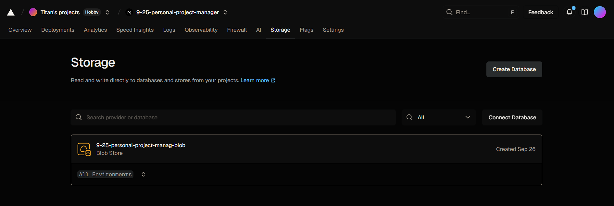

```
1. Vercel 專案 → Storage 頁籤
2. 點擊 "Create Database"
3. 選擇 "Supabase"（綠色閃電圖示）
4. 點擊 "Continue"
```

---

### 1.2 設定資料庫

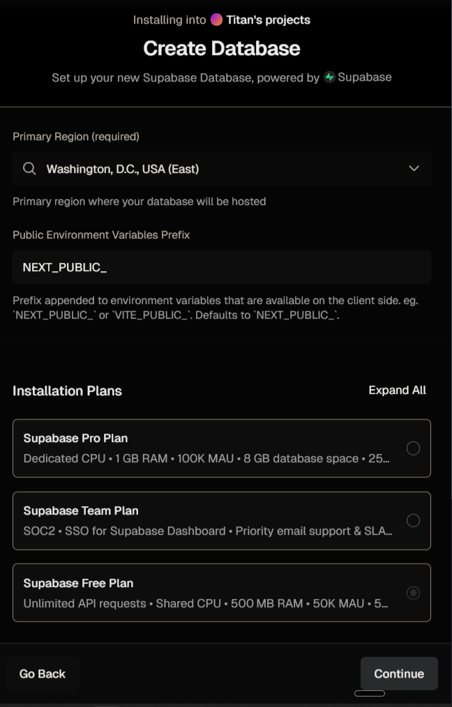

**✅ 3 個設定項目**：

```yaml
1. Primary Region（地區）:
   ✅ 選擇: Northeast Asia (Tokyo)
   原因: 台灣用戶延遲最低

2. Environment Variables Prefix（變數前綴）:
   ✅ 保持預設: NEXT_PUBLIC_
   
3. Installation Plans（方案）:
   ✅ 選擇: Supabase Free Plan（最下方）
   說明: 免費、無限 API 請求、500MB 空間
```

點擊 "Continue"

---

### 1.3 配置連接

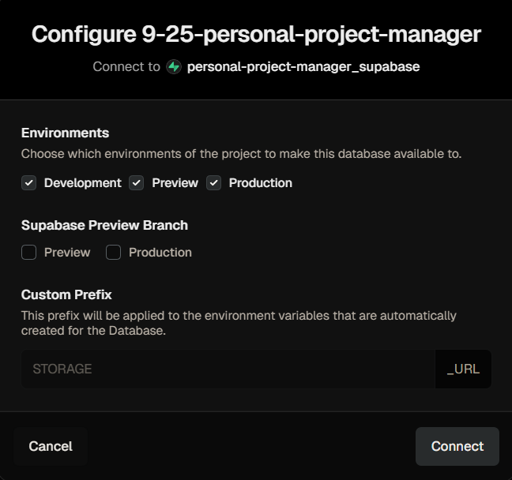

**✅ 保持預設**：

```
☑ Environments: Development, Preview, Production（全勾）
☐ Supabase Preview Branch: 都不勾
→ Custom Prefix: 不需修改
```

點擊 "Connect" 並等待 10-30 秒

---

### 1.4 確認連接成功

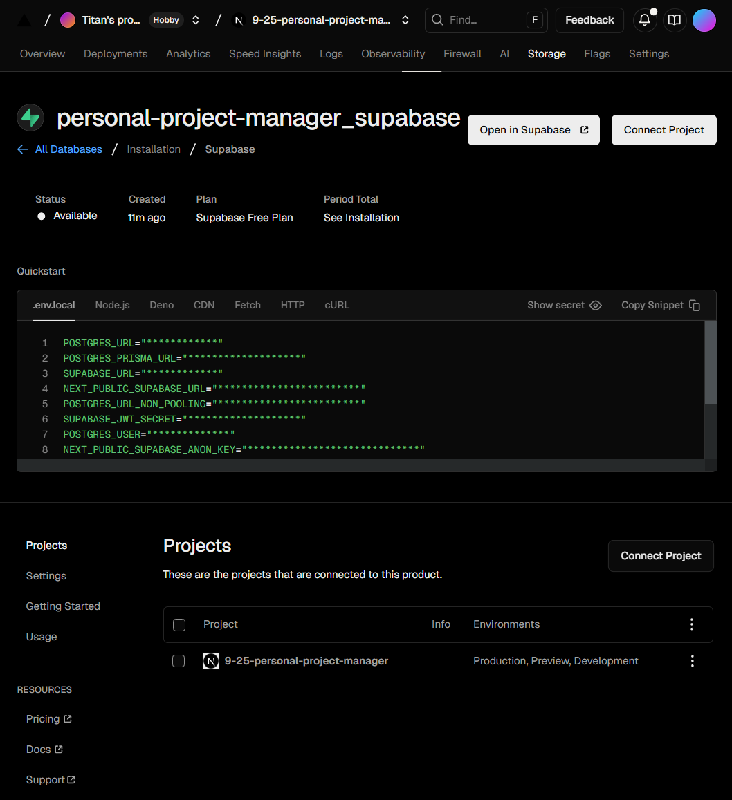

**✅ 成功指標**：
- ● Available（可用）
- 環境變數已自動注入

**下一步**：點擊右上角 **"Open in Supabase"** 按鈕

---

## 🔌 步驟 1.5：連接 Cursor Supabase MCP（可選但推薦）

> 💡 **什麼是 MCP？**  
> Model Context Protocol，讓 AI 助手直接操作 Supabase 資料庫，無需手動執行 SQL

### 為什麼要使用 MCP？

```yaml
優點:
  ✅ AI 自動建立資料表（節省 10-15 分鐘）
  ✅ 一鍵執行所有 SQL 操作
  ✅ 減少手動輸入錯誤
  ✅ 自動驗證資料表結構

缺點:
  ⚠️ 需要授權 Cursor 訪問 Supabase
  ⚠️ 首次設定需 2-3 分鐘
```

---

### 連接步驟（4 步驟）

#### 1️⃣ 前往 MCP 目錄

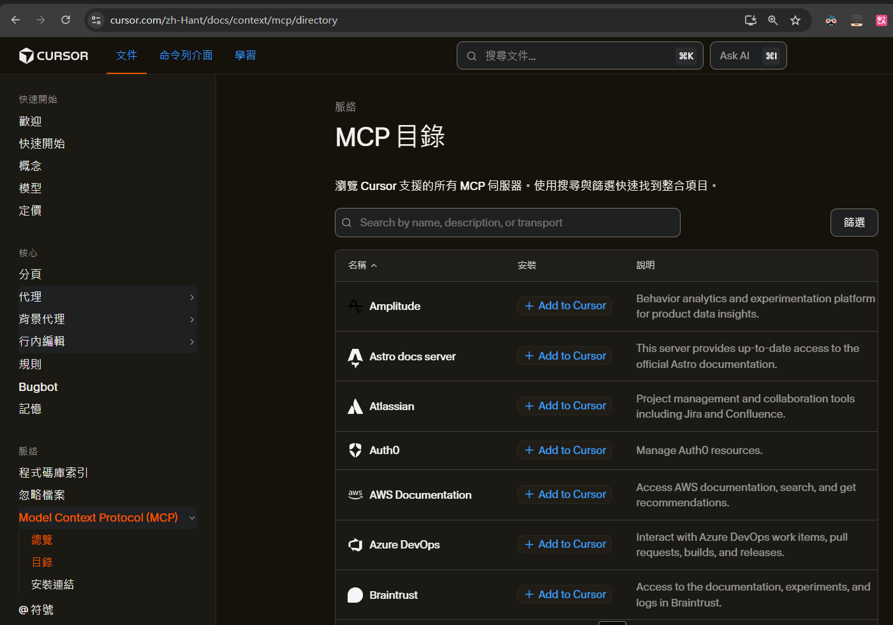

```
Cursor → 設定 → Tools & MCP → Model Context Protocol (MCP) → 目錄
或直接訪問: https://cursor.com/zh-Hant/docs/context/mcp/directory
```

找到 **Supabase** 並點擊

---

#### 2️⃣ 點擊 Add to Cursor

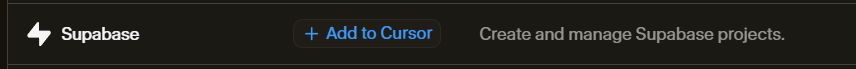

---

#### 3️⃣ 安裝 MCP Server

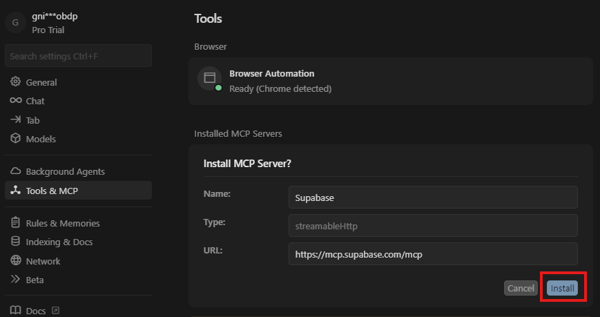

**設定資訊**（自動填入）：
```yaml
Name: Supabase
Type: streamableHttp
URL: https://mcp.supabase.com/mcp
```

點擊 **"Install"** 按鈕

---

#### 4️⃣ 授權連接

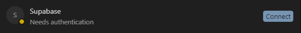

點擊 **"Connect"** 按鈕後會開啟授權頁面

---

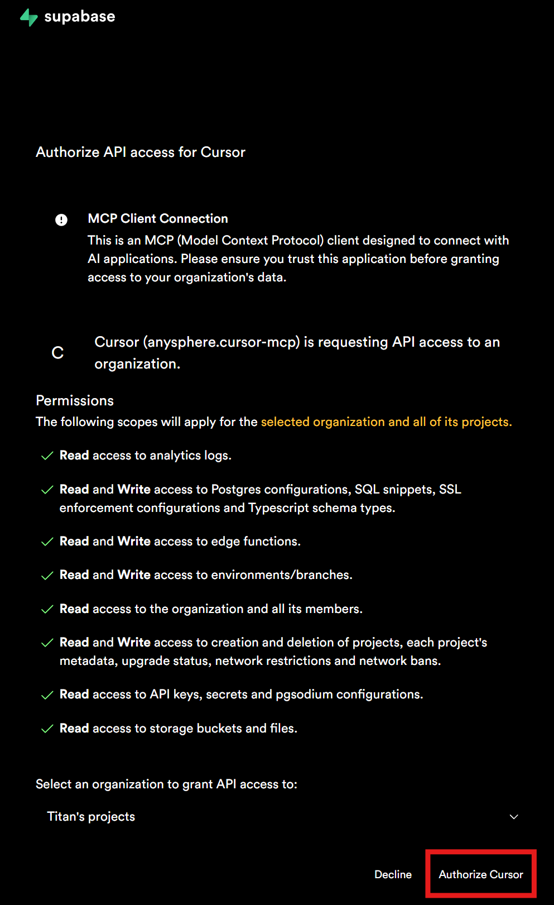

**授權權限說明**：
```yaml
授予 Cursor 的權限:
  ✓ 讀寫 Postgres 配置、SQL、TypeScript 類型
  ✓ 讀寫 Edge Functions
  ✓ 讀寫環境/分支
  ✓ 讀取組織成員
  ✓ 創建/刪除專案
  ✓ 讀取 API 金鑰
  ✓ 讀取 Storage buckets 和檔案
```

**重要**：
- 選擇組織：**Titan's projects**（或您的組織名稱）
- 點擊 **"Authorize Cursor"** 完成授權

---

#### ✅ 連接成功


**成功指標**：
- 顯示 `● 29 tools enabled`（綠點）
- Supabase MCP 已就緒

---

### 🎯 使用 MCP 的好處

```
完成 MCP 連接後，在步驟 2 建立資料表時：

傳統方式:
  ❌ 手動複製 SQL → 貼到 Supabase → 執行 → 驗證
  ⏱️ 需要 15-20 分鐘

使用 MCP:
  ✅ 告訴 AI："請建立 projects、passwords、settings 資料表"
  ✅ AI 自動執行所有 SQL
  ✅ 自動驗證結果
  ⏱️ 只需 2-3 分鐘
```

---

### 🤖 使用 MCP 自動建立資料表

**完成 MCP 連接後，使用此提示詞**：

#### 📝 提示詞

```
請使用 Supabase MCP 為我的專案建立以下資料表：

1. projects 資料表（21個欄位 + 索引 + 觸發器 + RLS）
2. passwords 資料表（5個欄位 + 觸發器 + RLS）
3. settings 資料表（3個欄位 + 預設資料 + 觸發器 + RLS）

請執行完成後驗證結果。


請你直接開始透過SuperBase的 MCP 直接開始進行全自動操作。
完成後在聊天室中列出結果報告，並在需文檔中寫入重點概要
```

#### ✅ 預期執行結果

**正常流程**：

```yaml
步驟 1: AI 開始執行
  → "我將使用 Supabase MCP 建立資料表..."

步驟 2: 建立 Projects 資料表
  → apply_migration: create_projects_table
  → ✅ 成功：22個欄位、4個索引、RLS已啟用

步驟 3: 建立 Passwords 資料表
  → apply_migration: create_passwords_table
  → ✅ 成功：6個欄位、RLS已啟用

步驟 4: 建立 Settings 資料表
  → apply_migration: create_settings_table
  → ✅ 成功：3個欄位、2筆預設資料、RLS已啟用

步驟 5: 驗證結果
  → list_tables 確認 3個資料表
  → list_migrations 確認 3個遷移記錄
  → ✅ 所有資料表建立完成
```

**成功訊息範例**：

```
✅ 資料庫設定完成！

已建立的資料表：
• projects - 22個欄位，RLS已啟用
• passwords - 6個欄位，RLS已啟用
• settings - 3個欄位，2筆預設資料，RLS已啟用

已應用的遷移：
• 20251028171332 - create_projects_table
• 20251028171344 - create_passwords_table
• 20251028171357 - create_settings_table

⏱️ 總耗時：約 2-3 分鐘
```

---

**如果不想使用 MCP**，可以跳過此步驟，依照步驟 2 手動建立資料表。

---

## 🏗️ 步驟 2：建立資料表（已透過 MCP 自動完成）

> ✅ **如果您已使用步驟 1.5 的 MCP**，資料表已自動建立完成

### 快速確認

<table>
<tr>
<td width="50%">

**Table Editor 介面**

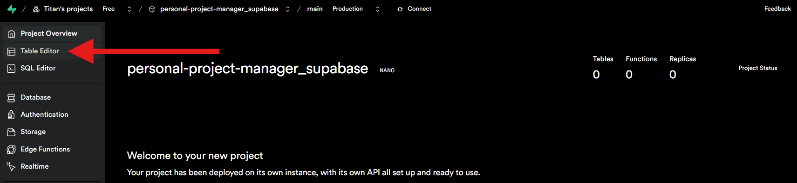

左側選單 → Table Editor

</td>
<td width="50%">

**應該看到 3 個資料表**

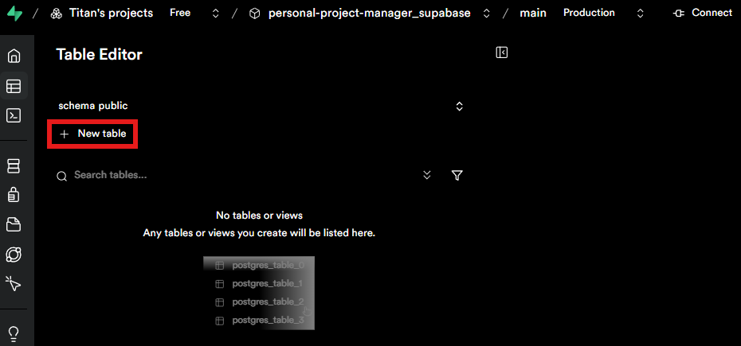

- ✅ projects（22欄位）
- ✅ passwords（6欄位）
- ✅ settings（3欄位）

</td>
</tr>
</table>

### MCP 已完成的項目

| 項目 | 狀態 | 說明 |
|------|------|------|
| **資料表** | ✅ | projects, passwords, settings |
| **索引** | ✅ | 4個索引提升查詢效能 |
| **觸發器** | ✅ | 自動更新 updated_at |
| **RLS 政策** | ✅ | 8個安全規則 |
| **預設資料** | ✅ | settings 的初始配置 |
| **Migration** | ✅ | 3個版本記錄 |

### 手動建表方式（僅供未使用 MCP 者）

<details>
<summary>點擊查看完整 SQL 腳本</summary>

**完整建表 SQL**請參考步驟 1.5 的 MCP 提示詞執行內容，包含：
- Projects 資料表（22欄位 + 索引 + 觸發器 + RLS）
- Passwords 資料表（6欄位 + 觸發器 + RLS）
- Settings 資料表（3欄位 + 預設資料 + 觸發器 + RLS）

</details>

---

### ⏳ 接下來需要手動操作

👉 **建立 Storage Bucket**（MCP 無法自動建立）

請繼續閱讀：**`02_手動建立Storage.md`**

---

## ✅ 階段完成檢核

### 確認以下事項

**在 Supabase 控制台**：
- [ ] ✅ Table Editor 顯示 3 個資料表
- [ ] ✅ Storage 顯示 screenshots bucket
- [ ] ✅ RLS 已啟用

**在 Vercel 控制台**：
- [ ] ✅ Environment Variables 包含：
  - NEXT_PUBLIC_SUPABASE_URL
  - NEXT_PUBLIC_SUPABASE_ANON_KEY
  - SUPABASE_SERVICE_ROLE_KEY

---

## 🎯 下一步

恭喜完成資料庫設定！

👉 **立即操作**：建立 Storage Bucket（`02_手動建立Storage.md`）  
👉 **完成後**：進入階段 2 資料遷移（`03_資料遷移操作.md`）


