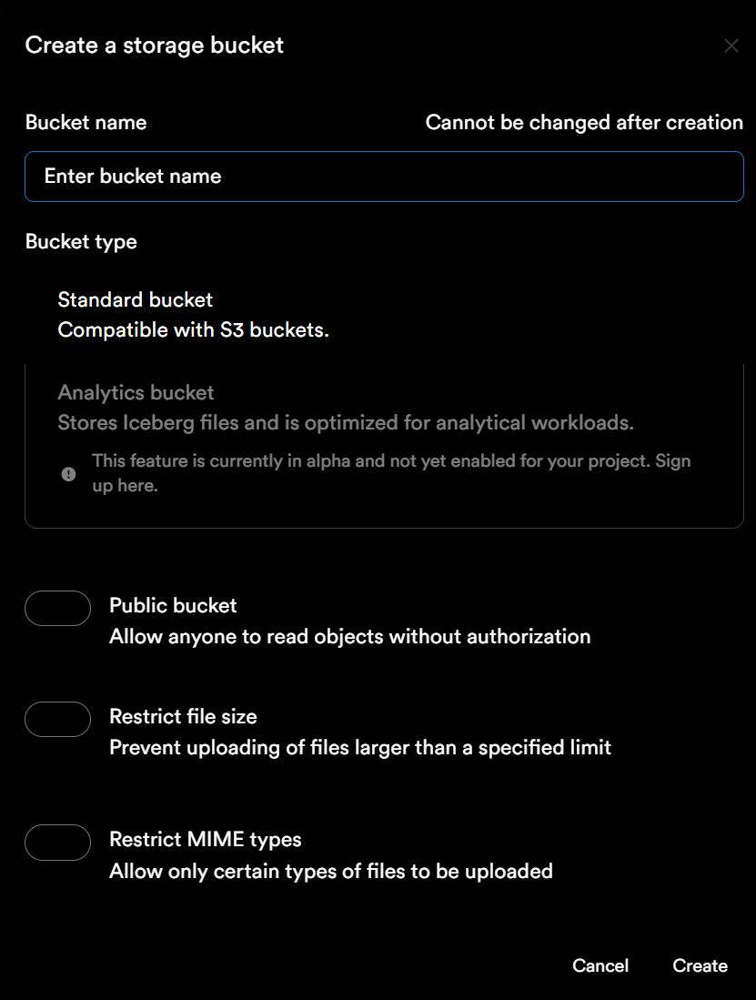

# 階段 1.5：手動建立 Storage Bucket

> ⏱️ 預估時間：1-2 分鐘  
> 🎯 目標：建立圖片儲存空間  
> 📝 原因：MCP 目前無法自動建立 Storage Bucket

---

## 📋 為什麼需要手動操作？

```yaml
MCP 限制說明:
  
Supabase MCP 提供的工具:
  ✅ 資料庫操作（CREATE TABLE、INSERT、SELECT 等）
  ✅ Migration 管理
  ✅ RLS 政策設定（透過 SQL）
  
MCP 無法執行:
  ❌ 建立 Storage Bucket（需透過 Supabase UI）
  ❌ 上傳檔案到 Storage
  ❌ UI 介面操作

解決方式:
  → 手動在 Supabase 控制台建立 Bucket（約 1 分鐘）
  → 之後可用 MCP 設定 Storage 政策（可選）
```

---

## 🗂️ 手動建立 Storage Bucket

### 3 個步驟（圖文對照）

<table>
<tr>
<td width="50%">

### 步驟 1：前往 Storage


**操作**：
```
左側選單 → 點擊 Storage
```

**說明**：
- 進入檔案儲存管理介面
- 可看到現有的 buckets（目前為空）

</td>
<td width="50%">

### 步驟 2：點擊 New bucket


**操作**：
```
點擊 "New bucket" 按鈕
```

**說明**：
- 位於左上角
- 開啟建立 bucket 表單
- 目前顯示 "No buckets available"

</td>
</tr>
</table>

---

### 步驟 3：填寫 Bucket 設定



#### 📝 設定項目說明

```yaml
1. Bucket name（Bucket 名稱）:
   輸入: project-images
   說明: 建立後無法更改，只能使用小寫字母、數字、連字號
   ⚠️ 必須使用: project-images（與程式碼設定一致）
   範例: project-images, screenshots, user-avatars
   ❌ 錯誤: Screenshots, 截圖, screen shots

2. Bucket type（Bucket 類型）:
   說明: 與 AWS S3 相容的標準儲存桶

   說明: 用於 Iceberg 檔案，目前為 Alpha 功能，不建議使用

3. Public bucket（公開 Bucket）:
   ☑ 必須勾選
   說明: 允許任何人無需授權即可讀取圖片
   
   詳細說明:
   - Public = 公開讀取
   - 上傳/刪除仍需透過後端 API 驗證
   - 適合展示網站的圖片、頭像等公開資源

4. Restrict file size（限制檔案大小）:
   ☐ 不勾選
   說明: 不限制檔案大小
   
   可選設定:
   - 如需限制，可設定最大檔案大小（如 10MB）
   - 防止上傳過大檔案

5. Restrict MIME types（限制檔案類型）:
   ☐ 不勾選
   說明: 不限制檔案類型
   
   可選設定:
   - 如需限制，可設定允許的類型（如只允許圖片）
   - 範例: image/jpeg, image/png, image/webp
```

---

### ✅ 完成建立

**操作**：
```
確認設定後，點擊右下角 "Create" 按鈕
```

**成功指標**：
```
✓ 回到 Storage 主頁
✓ 看到 "project-images" bucket
✓ 狀態為 Public
```

---

## 🔒 設定 Storage 政策（可選，可用 MCP）

### 方式 A：使用 AI + MCP（推薦）

**提示詞**：

```
請使用 Supabase MCP 為 project-images bucket 設定 Storage 政策：

1. 允許公開讀取
2. 允許管理員上傳
3. 允許管理員更新
4. 允許管理員刪除

請執行 SQL 設定政策。
```

**AI 會自動執行以下 SQL**：

```sql
-- 允許公開讀取
CREATE POLICY "Public Access"
ON storage.objects FOR SELECT
USING ( bucket_id = 'project-images' );

-- 允許管理員上傳
CREATE POLICY "Admin Upload"
ON storage.objects FOR INSERT
WITH CHECK ( bucket_id = 'project-images' );

-- 允許管理員更新
CREATE POLICY "Admin Update"
ON storage.objects FOR UPDATE
USING ( bucket_id = 'project-images' );

-- 允許管理員刪除
CREATE POLICY "Admin Delete"
ON storage.objects FOR DELETE
USING ( bucket_id = 'project-images' );
```

---

### 方式 B：手動在 Supabase 執行 SQL

**操作步驟**：

```
1. Supabase 控制台 → SQL Editor
2. 點擊 "New query"
3. 貼上上方 SQL
4. 點擊 "Run"
```

---

### 方式 C：在 Storage UI 設定（較複雜）

```
1. Storage → Policies
2. 點擊 "New Policy"
3. 手動設定每個政策的條件
```

**不推薦原因**：
- 需要逐一建立 4 個政策
- UI 操作較繁瑣
- 容易出錯

---

## ✅ 完成檢核

### 確認以下事項

**在 Supabase Storage 頁面**：

- [ ] ✅ 看到 **project-images** bucket
- [ ] ✅ Bucket 狀態為 **Public**
- [ ] ✅ Bucket 可以正常訪問

**在 Storage → Policies**（如果有設定）：

- [ ] ✅ 4 個政策已建立
- [ ] ✅ Public Access（SELECT）
- [ ] ✅ Admin Upload（INSERT）
- [ ] ✅ Admin Update（UPDATE）
- [ ] ✅ Admin Delete（DELETE）

---

## 🎯 下一步

完成 Storage Bucket 建立後：

```yaml
階段 1 完成度: 100% 🎉

已完成:
  ✅ Vercel 連接 Supabase
  ✅ 環境變數自動注入
  ✅ 3 個資料表（透過 MCP）
  ✅ Storage Bucket（手動）
  ✅ Storage 政策（可選）

下一階段:
  👉 階段 2：資料遷移操作
     檔案: 03_資料遷移操作.md
     
     內容:
     - 從 Vercel Blob 匯出現有資料
     - 匯入資料到 Supabase
     - 遷移圖片到 Storage
     - 驗證資料完整性
```

---

## 🆘 常見問題

**Q: Bucket 名稱輸入錯誤怎麼辦？**  
A: Bucket 建立後無法重新命名，只能刪除重建。建議建立前仔細確認。

**Q: 沒勾選 Public bucket 會怎樣？**  
A: 圖片需要認證才能訪問，前端無法直接顯示。可在 Storage → Bucket 設定中改為 Public。

**Q: Public bucket 安全嗎？**  
A: Public 只允許「讀取」，上傳/刪除仍需後端驗證。適合公開展示的圖片。

**Q: 可以建立多個 buckets 嗎？**  
A: 可以，免費方案支援多個 buckets。可依用途分類（如：screenshots、avatars、documents）。

**Q: Storage 政策一定要設定嗎？**  
A: 建議設定。如果不設定上傳/刪除政策，需在程式碼中使用 service_role key 操作。

**Q: 為什麼 MCP 不能建立 Bucket？**  
A: Supabase MCP 目前只提供資料庫操作 API，Storage Bucket 建立屬於管理操作，需透過 Supabase Management API 或 UI。

---

## 📊 總結對比

### 傳統全手動方式

```
時間: 20-25 分鐘

步驟:
1. 手動建立 projects 表（10 分鐘）
2. 手動建立 passwords 表（3 分鐘）
3. 手動建立 settings 表（3 分鐘）
4. 手動設定索引（2 分鐘）
5. 手動設定觸發器（2 分鐘）
6. 手動設定 RLS（2 分鐘）
7. 手動建立 Storage（1 分鐘）
8. 手動設定 Storage 政策（2 分鐘）
```

### 使用 MCP + 少量手動

```
時間: 3-4 分鐘

步驟:
1. MCP 自動建立 3 個表（2 分鐘）✨
2. 手動建立 Storage（1 分鐘）
3. MCP 設定 Storage 政策（1 分鐘）✨
```

### 節省時間

```
傳統: 20-25 分鐘
MCP:   3-4 分鐘

節省: 17-21 分鐘 🚀
效率提升: 83%
```

---

**恭喜完成階段 1！** 🎉

現在您的 Supabase 專案已經完全準備好，可以開始進行資料遷移了！

